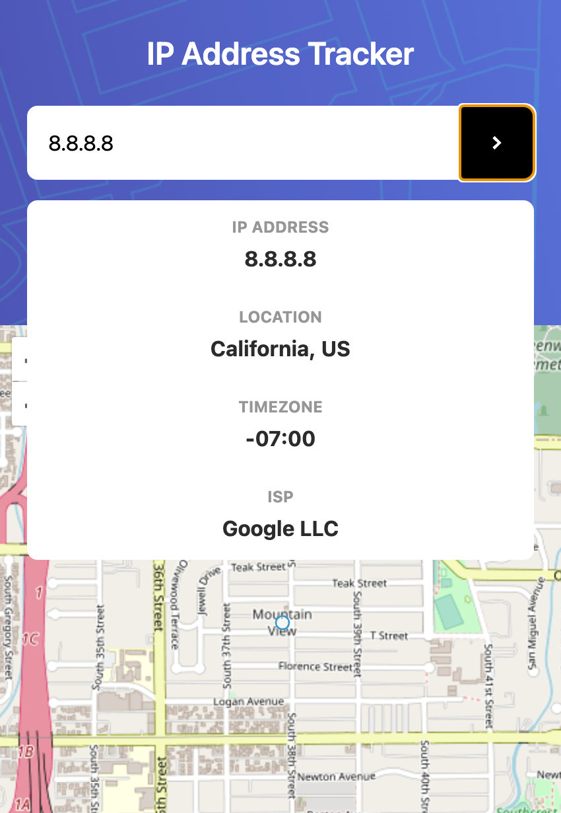

# Project Name: GeoLocator

A web application that utilizes OpenLayers and React to provide real-time geographical data and map visualization based on the user's IP address.

## Table of Contents

1. [Introduction](#introduction)
2. [Features](#features)
3. [Technologies](#technologies)
4. [What I Learned](#what-i-learned)
5. [Complex Piece of Code](#complex-piece-of-code)
6. [Usage](#usage)
7. [Contribute](#contribute)
8. [License](#license)

## Introduction

GeoLocator is a responsive and interactive map application that helps users in visualizing geographic locations based on IP addresses. It fetches real-time data and displays the location, region, country, timezone, and ISP information.

## Features

- **IP Lookup**: Allows users to enter an IP address to fetch its geographical details.
- **Map Interaction**: Enables zooming, panning, and clicking on the map.
- **Responsive Design**: Adapts to various screen sizes for a seamless experience.
- **Error Handling**: Provides informative error messages for a smooth user experience.


## Screenshots

## Desktop


## Mobile




## Technologies

- React
- OpenLayers
- CSS
- IP Geolocation API

## What I Learned

- **OpenLayers Integration**: Understanding the creation of interactive maps with OpenLayers.
- **React State Management**: Mastery of `useState` and `useEffect`.
- **Error Handling**: How to catch and display meaningful error messages.
- **API Interaction**: Communicating with APIs and manipulating JSON data.

## Complex Piece of Code

```jsx
useEffect(() => {
  if (latitude && longitude && featuresLayer && map) {
    const coords = transform([longitude, latitude], 'EPSG:4326', 'EPSG:3857');
    const feature = new Feature({
      geometry: new Point(coords),
    });

    const source = featuresLayer.getSource();
    source.clear();
    source.addFeature(feature);
    map.getView().fit(source.getExtent(), { padding: [100, 100, 100, 100] });
  }
}, [latitude, longitude, featuresLayer, map]);

```

## Usage

The application is deployed [here](). Enjoy exploring!


## Contribute

If you would like to contribute or find any bugs, please open an issue or submit a pull request.

## Acknowledgements

- [IP Geolocation API](https://ipgeolocation.io/)
- [OpenLayers](https://openlayers.org/)
- [React](https://reactjs.org/)
- [Frontend Mentor](https://www.frontendmentor.io/)
